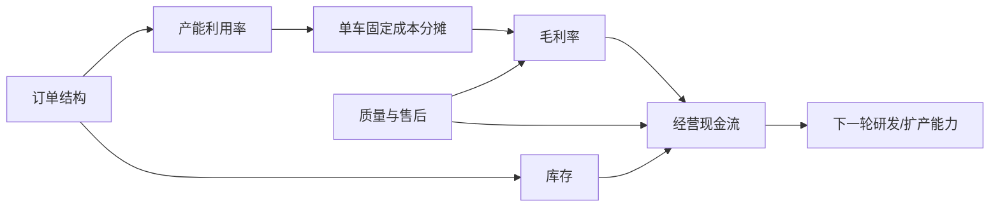

# 第2章：经营变量传导

小白最容易犯的错误，是把订单、产能、成本、库存、现金和质量当成独立指标。经营判断力的核心，是看懂这些变量如何传导。

## 1. 基础传导链

这张图的意思是：销量不是终点。订单结构决定工厂怎么跑，工厂怎么跑决定成本，成本决定毛利，毛利和库存共同决定现金流，现金流又决定下一轮资源投入。

## 2. 健康循环

健康的业务单元通常长这样：

1. 订单真实且结构稳定。
2. 工厂产能利用率提升。
3. 单车固定成本下降。
4. 毛利率改善。
5. 经营现金流变好。
6. 公司有能力继续投研发、渠道、质量和下一代产品。

判断句：

> 这不是简单销量增长，而是订单、产能、毛利和现金流共同改善。

## 3. 恶性循环

危险的业务单元通常长这样：

1. 新车型订单不及预期。
2. 工厂或产线利用率下降。
3. 固定成本无法摊薄。
4. 价格促销进一步压毛利。
5. 库存上升或现金流变差。
6. 管理层开始裁撤、重组或推迟项目。

判断句：

> 这不是单一车型失败，而是产品定义、产能、成本和组织节奏同时失配。

## 4. 用理想 MEGA 作为反向练习

不要直接写“MEGA失败”。要按传导链验证：

- 订单：公开交付和管理层表述是否说明需求低于预期？
- 产能：相关产线和车型规划是否出现调整？
- 成本：纯电车型成本结构是否不同于增程车型？
- 毛利：车辆毛利率是否承压？
- 现金：库存、经营现金流、费用是否出现压力？
- 组织：是否出现组织调整、销售体系变化或产品节奏调整？

只有这些证据能串起来，才可以写经营判断。

## 5. 用零跑作为正向或复杂案例

零跑适合训练“低成本、规模、合作和盈利质量”的判断：

- 销量增长是否带来规模效应？
- 毛利改善是否来自真实成本能力？
- 海外合作和技术授权是否改变收入结构？
- 盈利是否可持续，还是一次性因素影响？

## 6. 本章练习

选一家车企，把下面链条补完：

> 订单变化：____ -> 产能变化：____ -> 成本/毛利变化：____ -> 现金变化：____ -> 管理者下一步应该盯：____。

